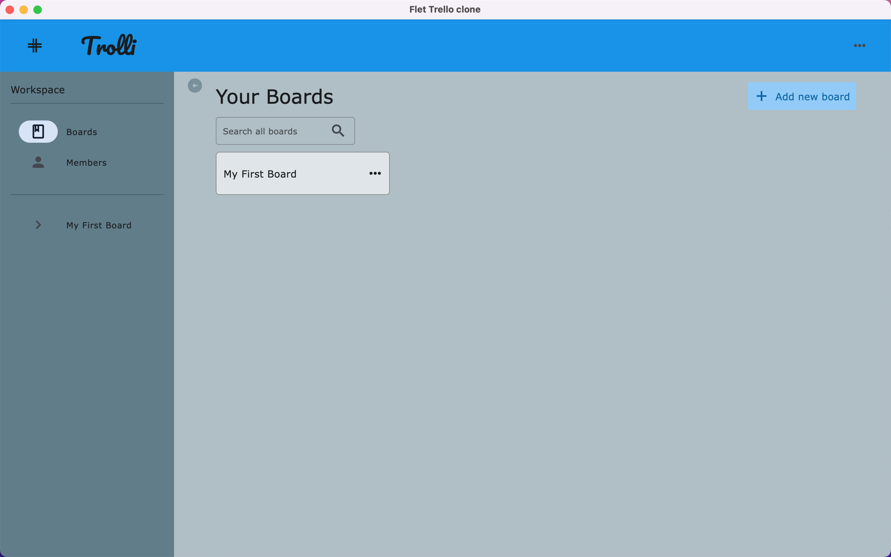

# trello-clone-flet-app

Trello Clone Flutter App built using Python (ft. [flet](https://flet.dev/)). 


> Check Python v3+ & Pip v3+ is installed?
```bash
python --version
pip --version
```

> Installation 
 ```bash
 pip install flet
 ```

> Run code
```bash
python src/main.py
```

### App Demo:

> Run the app on your pc.
```bash
python src/main.py
```




### Credits & Licensing:

> This project is been built during my python learning and exploring flet.dev framework. For Complete Tutorial read out [here](https://flet.dev/docs/tutorials/trello-clone) - Thanks.